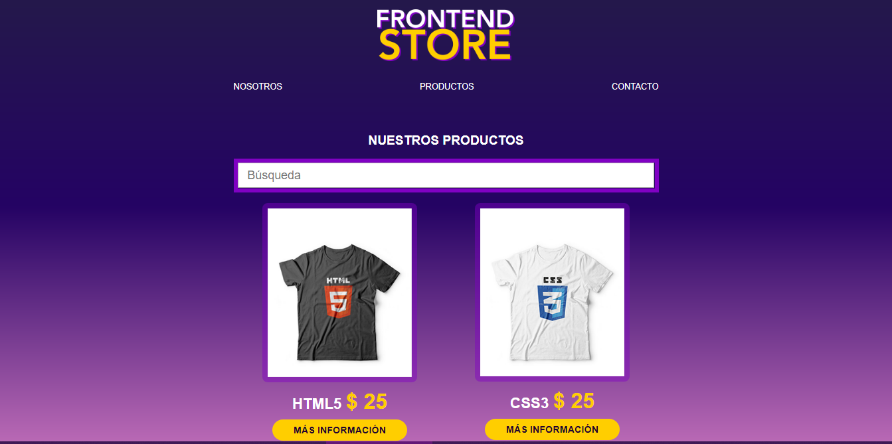

# frontendShopShirt
Este proyecto es un SPA (single page application) es una tienda virtual de camisetas/remeras en cual cuenta con un buscador, una sección de contacto, productos, nosotros; Más adelante se planea agregarle un login con un token  y una sección con un carrito para comprar los productos con tarjeta de credito o paypal, el sitio   esta realizado con Javascript utilizando React, Nodejs, Html5,Css3. 

PUEDES PROBARLO ONLINE EN EL SIGUIENTE LINK :)
https://frontendshopshirt.firebaseapp.com/

       INICIALIZANDO PROJECTO:
 1) Descargar el codigo, clonar el repositorio.
 2) abrir una nueva consola cmd en el caso de windows ubicarse dentro de la carpeta con el projecto.
 3) instalar los modulos de nodejs, ejecutando el comando: npm install
 4) una vez instalados los archivos de punto 3), ejecturar el comando: npm start 

